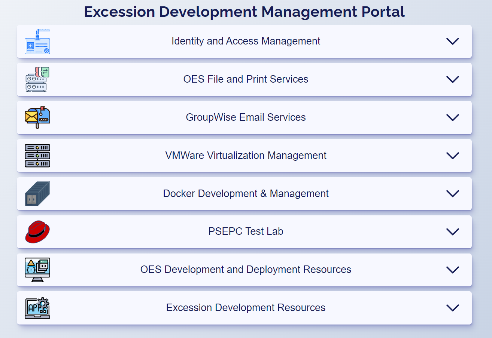

# Excession Development Management Portal

<!--  -->

This is my portal webpage to connect to all my servers and services in my lab. Most of these are for work related applications and are located behind a firewall on a private ip network.

<!--  -->

## Built with

- [HTML5](https://developer.mozilla.org/en-US/docs/Glossary/HTML5)
- [SASS](https://sass-lang.com/)
- [JavaScript](https://www.javascript.com/)

## Acknowledgements

Thanks to [Coding-in-Public](https://www.youtube.com/@CodinginPublic) for the [tutorial](https://www.youtube.com/watch?v=AxD9slgNDJI&t=9s) in animating and controlling accordion dropdowns.
