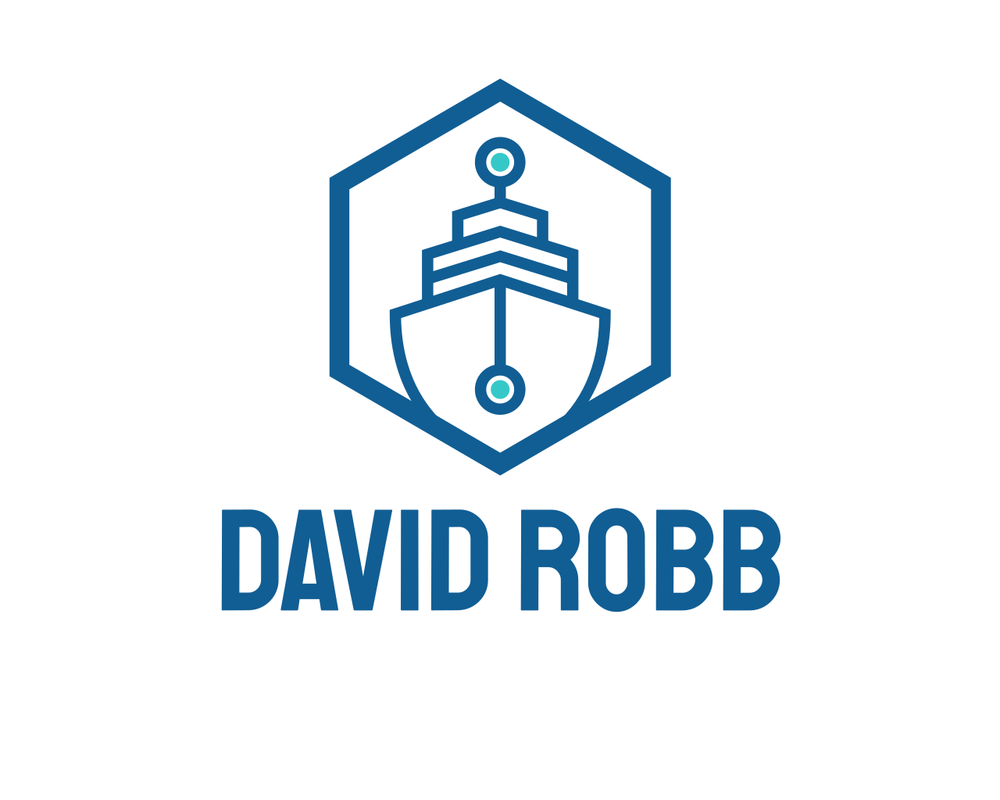

<div id="top"></div>
<!--
*** Thanks for checking out the Best-README-Template. If you have a suggestion
*** that would make this better, please fork the repo and create a pull request
*** or simply open an issue with the tag "enhancement".
*** Don't forget to give the project a star!
*** Thanks again! Now go create something AMAZING! :D
-->

<!-- PROJECT SHIELDS -->
<!--
*** I'm using markdown "reference style" links for readability.
*** Reference links are enclosed in brackets [ ] instead of parentheses ( ).
*** See the bottom of this document for the declaration of the reference variables
*** for contributors-url, forks-url, etc. This is an optional, concise syntax you may use.
*** https://www.markdownguide.org/basic-syntax/#reference-style-links
-->

[![Contributors][contributors-shield]][contributors-url]
[![Forks][forks-shield]][forks-url]
[![Stargazers][stars-shield]][stars-url]
[![Issues][issues-shield]][issues-url]
[![MIT License][license-shield]][license-url]
[![LinkedIn][linkedin-shield]][linkedin-url]

<!-- PROJECT LOGO -->
<br />
<div align="center">
  <a href="https://github.com/drobb2020/excession-management-portal">
    
  </a>

  <h3 align="center">Excession Development Management Portal</h3>

  <p align="center">
    A single pane landing page so I can manage all my services in my business lab.
    <br />
    <a href="https://github.com/drobb2020/excession-management-portal"><strong>Explore the docs »</strong></a>
    <br />
    <br />
    <a href="https://github.com/drobb2020/excession-management-portal">View Demo</a>
    ·
    <a href="https://github.com/drobb2020/excession-management-portal/issues">Report Bug</a>
    ·
    <a href="https://github.com/drobb2020/excession-management-portal/issues">Request Feature</a>
  </p>
</div>

<!-- TABLE OF CONTENTS -->
<details>
  <summary>Table of Contents</summary>
  <ol>
    <li>
      <a href="#about-the-project">About The Project</a>
      <ul>
        <li><a href="#built-with">Built With</a></li>
      </ul>
    </li>
    <li>
      <a href="#getting-started">Getting Started</a>
      <ul>
        <li><a href="#prerequisites">Prerequisites</a></li>
        <li><a href="#installation">Installation</a></li>
      </ul>
    </li>
    <li><a href="#usage">Usage</a></li>
    <li><a href="#contributing">Contributing</a></li>
    <li><a href="#license">License</a></li>
    <li><a href="#contact">Contact</a></li>
    <li><a href="#acknowledgments">Acknowledgments</a></li>
  </ol>
</details>

<!-- ABOUT THE PROJECT -->

## About The Project

[![Excession Management Portal][product-screenshot]](https://excs-s5130.excession.org)

I have so many servers and services in my lab that I decided to create this landing page so I only have to go a single page to access all of my services. Most of these applications are related to my job as a Solution Support Engineer.

<p align="right">(<a href="#top">back to top</a>)</p>

### Built With

- [HTML](https://developer.mozilla.org/en-US/docs/Glossary/HTML5)
- [CSS (SCSS)](https://sass-lang.com/)
- [JavaScript](https://www.javascript.com/)
- [Font Awesome](https://fontawesome.com)

<p align="right">(<a href="#top">back to top</a>)</p>

<!-- GETTING STARTED -->

## Getting Started

Feel free to clone or download this repository as a model to build your own management portal.

### Installation

1. Clone the repo

   ```sh
   git clone https://github.com/drobb2020/excession-management-portal.git
   ```

2. Use VSCode as your editor and customize to your hearts content.

<p align="right">(<a href="#top">back to top</a>)</p>

<!-- USAGE EXAMPLES -->

## Usage

This website is quite specific on usage as the links connect to Micro Focus software installed in my lab. Feel free to use the framework to build your own management portal.

<p align="right">(<a href="#top">back to top</a>)</p>

See the [open issues](https://github.com/drobb2020/excession-management-portal/issues) for a full list of proposed features (and known issues).

<p align="right">(<a href="#top">back to top</a>)</p>

<!-- CONTRIBUTING -->

## Contributing

Contributions are what make the open source community such an amazing place to learn, inspire, and create. Any contributions you make are **greatly appreciated**.

If you have a suggestion that would make this better, please fork the repo and create a pull request. You can also simply open an issue with the tag "enhancement".
Don't forget to give the project a star! Thanks again!

1. Fork the Project
2. Create your Feature Branch (`git checkout -b feature/AmazingFeature`)
3. Commit your Changes (`git commit -m 'Add some AmazingFeature'`)
4. Push to the Branch (`git push origin feature/AmazingFeature`)
5. Open a Pull Request

<p align="right">(<a href="#top">back to top</a>)</p>

<!-- LICENSE -->

## License

Distributed under the MIT License. See `LICENSE.txt` for more information.

<p align="right">(<a href="#top">back to top</a>)</p>

<!-- CONTACT -->

## Contact

Your Name - drobb2011@gmail.com

Project Link: [https://github.com/drobb2020/excession-management-portal](https://github.com/drobb2020/excession-management-portal)

<p align="right">(<a href="#top">back to top</a>)</p>

<!-- ACKNOWLEDGMENTS -->

## Acknowledgments

Thanks to [Coding-in-Public](https://www.youtube.com/@CodinginPublic) for the [tutorial](https://www.youtube.com/watch?v=AxD9slgNDJI&t=9s) in animating and controlling accordion dropdowns.

<p align="right">(<a href="#top">back to top</a>)</p>

<!-- MARKDOWN LINKS & IMAGES -->
<!-- https://www.markdownguide.org/basic-syntax/#reference-style-links -->

[contributors-shield]: https://img.shields.io/github/contributors/drobb2020/excession-management-portal.svg?style=for-the-badge
[contributors-url]: https://github.com/drobb2020/excession-management-portal/graphs/contributors
[forks-shield]: https://img.shields.io/github/forks/drobb2020/excession-management-portal.svg?style=for-the-badge
[forks-url]: https://github.com/drobb2020/excession-management-portal/network/members
[stars-shield]: https://img.shields.io/github/stars/drobb2020/excession-management-portal.svg?style=for-the-badge
[stars-url]: https://github.com/drobb2020/excession-management-portal/stargazers
[issues-shield]: https://img.shields.io/github/issues/drobb2020/excession-management-portal.svg?style=for-the-badge
[issues-url]: https://github.com/drobb2020/excession-management-portal/issues
[license-shield]: https://img.shields.io/github/license/drobb2020/excession-management-portal.svg?style=for-the-badge
[license-url]: https://github.com/drobb2020/excession-management-portal/blob/master/LICENSE.txt
[linkedin-shield]: https://img.shields.io/badge/-LinkedIn-black.svg?style=for-the-badge&logo=linkedin&colorB=555
[linkedin-url]: https://linkedin.com/in/othneildrew
[product-screenshot]: images/Screenshot2025-01.png
